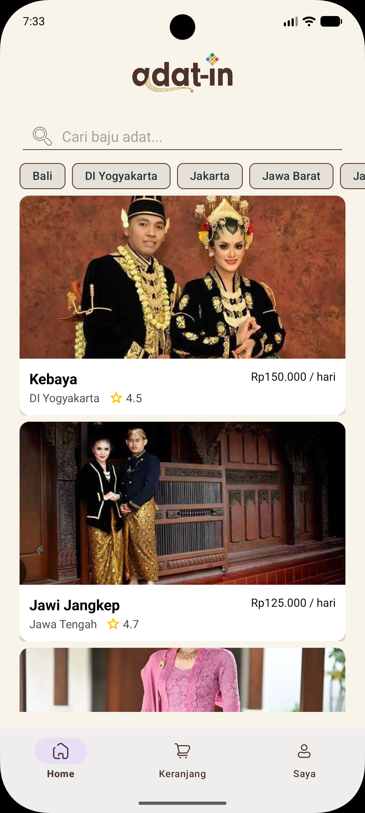
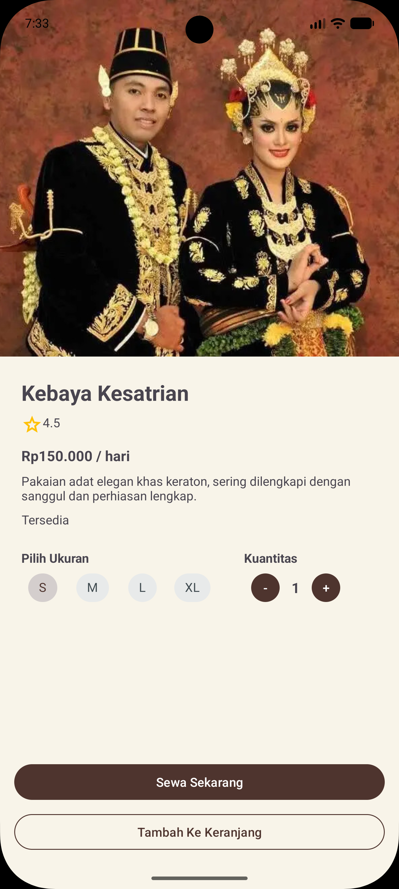
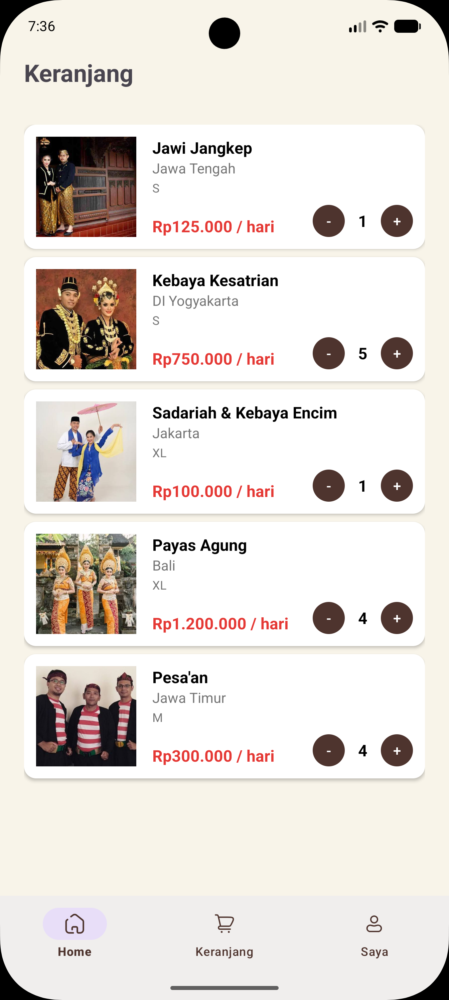
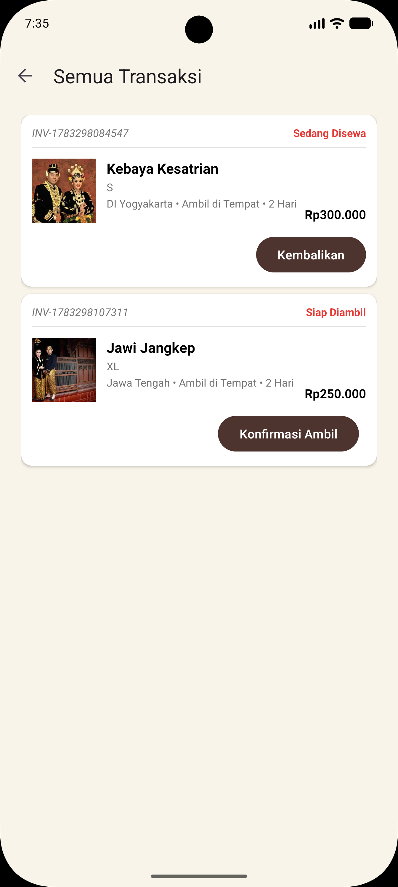

# AdatIn

AdatIn is a specialized mobile application engineered for the Android platform, designed to facilitate the rental of traditional Indonesian clothing (Pakaian Adat).

[](https://github.com/adwerygaming/AdatIn)
[](https://developer.android.com/)
[](https://kotlinlang.org/)
[](http://www.apache.org/licenses/LICENSE-2.0)

## Table of Contents
1. [Overview](#overview)
2. [Features](#features)
3. [Tech Stack](#tech-stack)
4. [Screenshots](#screenshots)
5. [Installation](#installation)
6. [Usage](#usage)
7. [Project Structure](#project-structure)
8. [License](#license)
9. [Development Team](#development-team)

## Overview
AdatIn is designed to preserve and promote Indonesian cultural heritage by lowering the barrier to accessing traditional garments for cultural ceremonies, educational events, and festivals. By providing a digitized marketplace for traditional attire, the application bridges the gap between local vendors and consumers, fostering cultural appreciation and supporting local artisanal economies.

## Features
- **User Authentication and Session Management**: Persistent user session validation via local shared preferences and registration/login validation handlers.
- **UI/UX and Dynamic Asset Binding**: Interface conforming to Material Design 3 guidelines with seamless bottom navigation transitions and asynchronous image loading.
- **Data Management and Search**: Dynamic catalog search and regional filtering of traditional garments.
- **In-Memory Cart State**: Local state management enabling dynamic item addition, quantity modification, and item removal.
- **Transaction and Order Lifecycle Tracking**: Checkout flow supporting delivery fee calculation, pickup configurations, and a simulated transaction status state machine (processing, shipping, pickup, return, completion, and cancellation) driven by Kotlin coroutines.

## Tech Stack
- **Language**: Kotlin
- **UI Framework**: Native Android (XML Views & Material Components)
- **Image Loading**: Coil (v2.7.0)
- **Build System**: Gradle Kotlin DSL (v9.2.1 Android Gradle Plugin)
- **Minimum SDK**: API 31 (Android 12)
- **Target SDK**: API 37 (Android 15)

## Screenshots
Below are the interface previews for key application screens:

| Splash Screen | Home Catalog | Product Detail |
| :---: | :---: | :---: |
|  |  |  |

| Shopping Cart | Transactions |
| :---: | :---: |
|  |  |

## Installation
1. Clone the repository:
   ```bash
   git clone https://github.com/adwerygaming/AdatIn.git
   cd AdatIn
   ```
2. Open the project in Android Studio (Giraffe or newer recommended).
3. Sync the Gradle files (`build.gradle.kts`).
4. Run the application on an emulator or physical device running Android 12 (API 31) or higher.

## Usage
- **Launch**: Open the application, which loads the `SplashScreenActivity` and redirects to `LoginActivity` or `MainActivity` depending on the session status.
- **Browse & Search**: Use the home catalog to view traditional garments, search for names, or filter by regional categories.
- **Rent**: Select an item to view details, add it to the cart, specify delivery options, and proceed through the simulated checkout and payment flow.

## Project Structure
```
app/src/main/
├── AndroidManifest.xml
├── java/id/my/masdepan/adatin/
│   ├── adapter/             # RecyclerView Adapters
│   ├── model/               # Data models
│   ├── BottomNav.kt         # Bottom navigation helper
│   ├── CheckoutActivity.kt  # Checkout controller
│   └── ...                  # Activity controllers
└── res/
    ├── layout/              # XML layout resources
    ├── menu/                # Bottom navigation menu
    └── values/              # Strings, colors, and themes
```

## License
This project is licensed under the Apache License 2.0. See the file headers or reference the [Apache License 2.0](http://www.apache.org/licenses/LICENSE-2.0) for details.

## Development Team
- Yoga Aditiya Putra
- Iqbal Dimas Saputra
- Indyra Zulaeyka Rabbani
- Fikki Rahmat Maulana
- Dhevan Adhitya Prasetyo